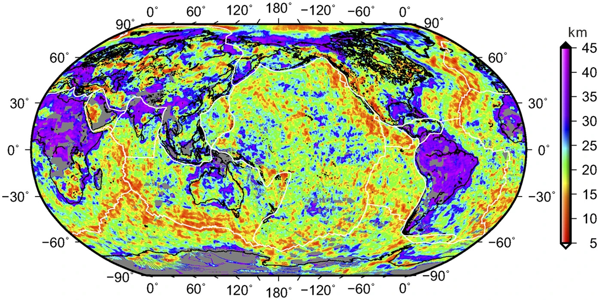

# The global reference Curie-point depth model (GCDM) estimated from the Earth Magnetic Anomaly Grid of αarc-minute resolution (EMAG2)

[The global reference Curie-point depth model (GCDM) (GeoTIFF)](41598_2017_BFsrep45129_MOESM71_ESM.tif)

## Pictures from the paper



## Processing the dataset

```
grep -v NaN 41598_2017_BFsrep45129_MOESM71_ESM.txt > 41598_2017_BFsrep45129_MOESM71_ESM.xyz
gdal_translate -a_srs WGS84 41598_2017_BFsrep45129_MOESM71_ESM.xyz 41598_2017_BFsrep45129_MOESM71_ESM.tif
```

## References (see also local copies of the papers and data files)

[A global reference model of Curie-point depths based on EMAG2](https://www.nature.com/articles/srep45129?error=cookies_not_supported&code=5244f171-62e1-4d19-9e22-0c49eb92c369)

[Supplementary Dataset 1 (TXT 120908 kb)](https://static-content.springer.com/esm/art%3A10.1038%2Fsrep45129/MediaObjects/41598_2017_BFsrep45129_MOESM71_ESM.txt)
